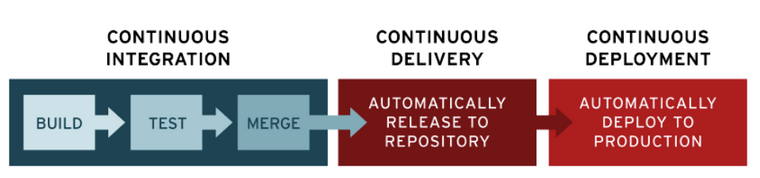
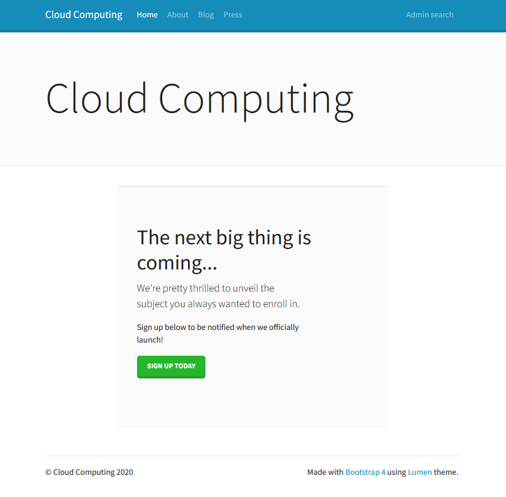
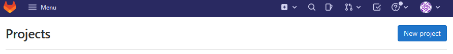
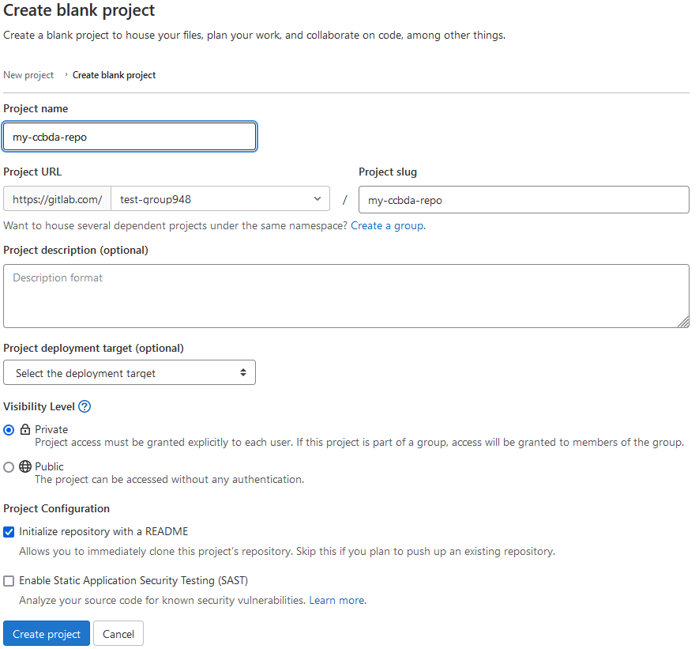
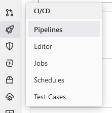
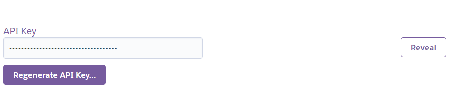
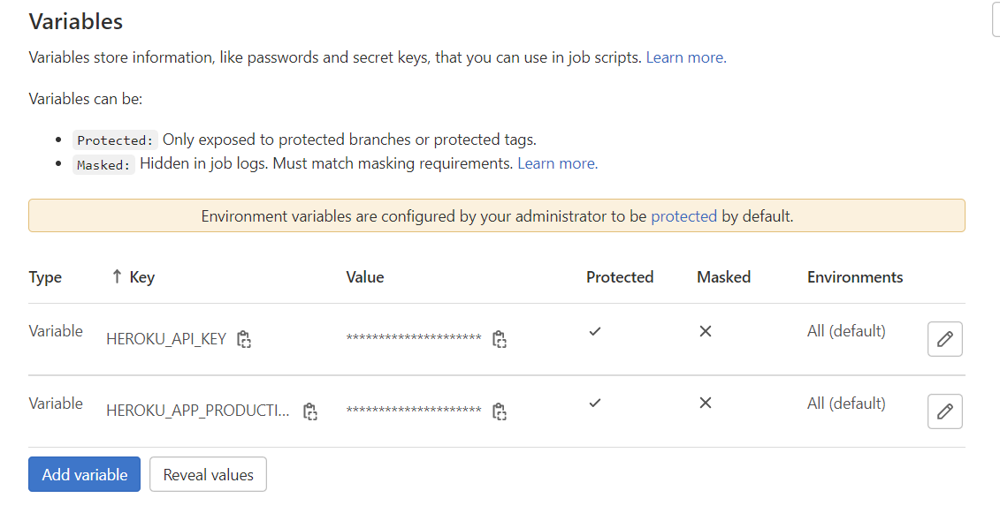
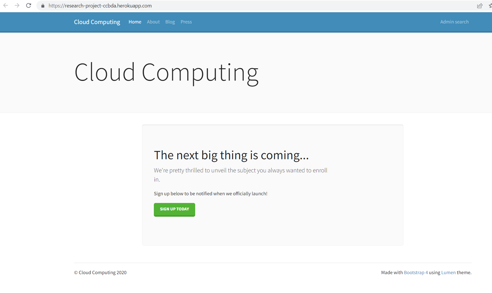

# Research Project - CICD Pipeline with Heroku

## Introduction
In this task, we are going to implement a CI/CD pipeline to speed up the development process. To do so, we are going to use a very simple Django project that we provide for you and that we will deploy to [Heroku](https://www.heroku.com/). Furthermore, we are going to use [Gitlab](https://about.gitlab.com/) instead of GitHub. This is due to a security breach that was recently discovered in Heroku together with GitHub. For interested readers, you can find more information about that [here](https://status.heroku.com/incidents/2413).

### Continuous Integration/Continuous Delivery(CI/CD)
Imagine that you are working in a large team on a website together with a customer that dynamically adapts his/her wishes to the design of the website and asks for more features. Evolving the website in such a way requires adding new code, often by different team members, and integrating it into the old code. Furthermore, the code with the new changes needs to be built, delivered and deployed. Depending on different errors that the developer can make when committing (forgetting to commit files for example), or the type of change itself, this process takes a lot of time from the developers, who’d rather focus on developing itself. This scenario is sometimes called “integration hell”. To alleviate the problem, we introduce automation into the software development process that tries to address these issues.

In general, we refer to this automation in two different stages with different terms. CI refers to continuous integration. It has the goal that new code changes are regularly built, tested and merged into a shared repository. This resolves the problem of having too many branches that could conflict with each other. For stages after code integration, we use the term continuous delivery/deployment (CD).

We can either use the terms' deployment/delivery interchangeably or use them to specify more exactly which type of automation we use. Continuous delivery usually refers to automatically bug-testing an application and uploading it to a repository so that it can be deployed to a live production environment. This solves the problem of bad communication between the business and development team. After having delivered, we can further automate by releasing the changes so that they are visible to the customer. This is usually called continuous deployment. It alleviates the problem of overloaded operation teams with changes that require manual processing.



### Heroku
As already mentioned, we are going to use Heroku for the deployment of our simple test app. [Heroku](https://www.heroku.com/) is a Platform as a Service (PaaS) that helps us deploy, manage and scale modern apps. It is very simple and offers the possibility to create free accounts. We chose Heroku as a deployment platform because it is very well known, widely used, and offers a good lightweight alternative to some services of AWS which we have seen already.


### Software testing and unit tests
Testing software is as important, if not more, as developing it.

> Software Testing is important because if there are any bugs or errors in the software, it can be identified early and can be solved before delivery of the software product. Properly tested software product ensures reliability, security and high performance which further results in time saving, cost-effectiveness and customer satisfaction ([Source](https://www.guru99.com/software-testing-introduction-importance.html)).

It is so important that a famous development method even requires tests to be made before the actual tested code, to ensure that what is being developed meet functional requirements: it is called **Test Driven Development**.

In this tutorial, we will present the basics of software testing with unit test applied to a Django website (based on Lab 4 website). There are [many other software testing methods](https://hackr.io/blog/types-of-software-testing) but will be out of scope of this tutorial.

## Tasks

### Task 1: Setting up a Django website
We are going to set up our environment to test the website locally and look at its structure. We recommend you creating a virtual Python environment for this task, but it isn't mandatory.
Extract `website.zip` to a new folder of your choice then install required Python dependencies (such as Django and others) using:
````
pip install -r requirements.txt
````

To run the website locally, you can use:
````
$ python manage.py migrate
$ python manage.py runserver
````
Note that the `migrate` command is used to [incorporate changes into the server](https://docs.djangoproject.com/en/4.0/topics/migrations/). We do this the first time when running to avoid a warning.
Executing the above snippet should produce a similar output to the following:
````
May 07, 2022 - 12:42:43
Django version 4.0.4, using settings 'eb_django_express_signup.settings'
Starting development server at http://127.0.0.1:8000/
Quit the server with CTRL-BREAK.
````

You may then want to see our freshly running website at the provided URL:



### Task 2: Creating your first unit test
According to [Wikipedia](https://en.wikipedia.org/wiki/Unit_testing):
> unit testing is a software testing method by which individual units of source code—sets of one or more computer program modules together with associated control data, usage procedures, and operating procedures—are tested to determine whether they are fit for use.

Because unit testing is a concept, you can code them by hand but very useful unit testing framework exists in order make your testing more efficient. The Django framework includes a [unit testing framework](https://docs.djangoproject.com/en/4.0/topics/testing/overview/) based on Python's [unittest](https://docs.python.org/3/library/unittest.html) module.

Our goal here is to test one functionality of the website and ensure that it works as intended.

To use Django's unit test capabilities, we created a `tests` folder for you in the root folder of the website where you'll find a `__init__.py` file. Add the following code to a new Python file called `test_sample.py` in the same folder:
````python
from django.test import TestCase

"""Basic example of a Django Unit test on models"""
class MyFirstTestCase(TestCase):
    def test_entry_retrieval(self):
        """Testing Admin page correct display of retrieved entries from the database.
        """

        """We'll simulate a successfully parsed response of the database
        and see if our form displays it correctly."""

        self.assertTrue(True)
````

Let's detail the file's content. You can divide your Python test files by functionality or page for example. Then declare as much method as you wish which are our unit tests. For each method, you have to return an assertion to ensure that your product is having the intended behavior: which is the purpose of the ``assertTrue`` return method. Note that since this is not a module about writing tests but about integrating them into the CI/CD pipeline, we use `assertTrue(true)`. In a real application, we would naturally write tests that actually test our code.

In real life cases, you might have a lot of Python test files like this, in the ``tests`` folder. To automatically run all those tests, use the following command:
````
python manage.py test
````

If everything went fine, you should have a similar output to this one:
````
Creating test database for alias 'default'...
System check identified no issues (0 silenced).
.
----------------------------------------------------------------------
Ran 1 test in 0.001s

OK
Destroying test database for alias 'default'...
````

**Q1) We used ``assertTrue`` above but can you give 2 other assertions' method of Django's unit test framework ?**

**Q2) Write a test that is supposed to fail and look at the test running output. What can you see in the Python output ?**

It will be required to remove the failing test to finish the assignment (i.e for the Heroku CI/CD Pipeline in the last assignment) but feel free to keep it for now to see its effects when executing the pipeline on gitlab.

### Task 3: Creating the Gitlab Project
First, we'll need to create an account on [Gitlab](https://gitlab.com/). Gitlab interface being similar to GitHub's, we'll not enter into details. After doing so, create a **Project** by clicking on the top right button:


> You might wonder why Gitlab uses the "Project" terminology instead of "Repository" like we could find on GitHub. Gitlab is an end-to-end software development platform including version control and issue tracking like GitHub but also others tools that we'll not use in this tutorial.

Select the *Create blank project* option then choose your *Project name*. You don't need to change any of the other options as shown below:


As you would do with a GitHub repo, set the remote repository origin in your local website folder where you previously extracted the website. This can be done using the following commands with URL that can be found under the *Clone* button, in the *Clone with HTTPS* section:
````
git init -b main
git add .
git commit -m "Initial commit"
git remote add origin https://gitlab.com/YOUR_GROUP/YOUR_REPO.git
git branch -M main
git push -uf origin main
````

In case you encounter an error message saying that you cannot use *HTTPS*, use [ssh](https://docs.gitlab.com/ee/user/ssh.html) instead.

### Task 4: Creating and running the CI/CD Pipeline
Now that you've got your whole test baseline, you may want to run them each time you push to ensure that you are going to commit a working code on your repository. But because developers are lazy, we want to optimize this by automatically running the test when you are pushing the code: which is one of the main purpose of **CI/CD pipelines**.

Although not being the case in this project using Python, you might need to retrieve up-to-date dependencies or build your project, which would be additional repetitive tasks that could be added to the pipeline, which is running on Gitlab server.

After setting up everything correctly, you will be able to see a success status of the commit (which will tell us we have been able to pass all the build, tests etc.) like this:


Those repetitive will be called **jobs** in CI/CD Pipeline and are very simple to create, using a file called ``.gitlab-ci.yml``. An exemple of the structure of this config file can be see below although we won't use this one for the rest of the assignement (we'll provide you the starting config file later):
````yaml
build-job:
  stage: build
  script:
    - echo "Hello, $GITLAB_USER_LOGIN!"

test-job1:
  stage: test
  script:
    - echo "This job tests something"

deploy-prod:
  stage: deploy
  script:
    - echo "This job deploys something from the $CI_COMMIT_BRANCH branch."
````

Each of those jobs corresponds to different steps and are simple commands that you would have needed to run by hand without this automation.

In our case, our pipeline will have two stages:
* Test running at each push
* Deployment to Heroku (presented later) if the above test passed

Copy the ``.gitlab-ci.yml`` file in the root folder of your local repo. It is the file responsible for setting up the CI/CD pipeline that we will be filling together until the end of the assignment.

> For those interested into understanding how it is structured, you will see several jobs that we needed but also some basic linux commands to install tools. In fact, the ``Gitlab server`` - mentioned above - is called a **runner** and can be based on any machine. Gitlab provides shared runners that allow the usage of Ubuntu machines, but you may also want to deploy your code on your favorite Docker image on their server or even configure your own runner on your machine !
>
> As we are using a basic Ubuntu image, we have to install everything needed to run the project correctly. You might think about installing pip packages but we in fact also have to install *pip* itself, git tools or a specific version of Python if needed.

You will see that our current pipeline contains two jobs:
* migrations
* django-tests

and each of them contains basic linux commands that will be called when the job is being done.

**Q3) We want the pipeline to run our Django test in the ``django-tests`` job. To do so, add the command we presented above to run tests, the same way you would have done on your own machine.**

Then push a commit with the CI/CD configuration file added and go on your project's home page. You will see that the pipeline failed but this time not because the tests didn't pass but rather because Gitlab need you to validate your account. To do so, follow the steps given in the header notification (it is free of charges, they will take ~1€ and give them back to you instantly).

Then run the pipeline again by going in the Pipeline page using the left sidebar:



Then use the **Run pipeline** button again and wait for a few moments to let it run your jobs. You can follow the status of the pipeline by clicking on it in the list of runs, on the same page.


### Task 5: Setting up Heroku
Now that we have a testing pipeline, we also want to be able to automatically deploy the app if the tests succeed. In order to do so, we need an Heroku account. Go to the [Signup Page](https://signup.heroku.com/) and follow the instructions to create an account. Once you are ready go to your dashboard and create a new app. Give it a name and host it in Europe. In the overview, clicking onto **Open App* will lead you to a default application that is hosted on Heroku.

### Task 6: Creating a Key and Linking it to Gitlab
Later, we want to access our Heroku from Gitlab. To do so, we need to generate API keys in Heroku and deposit them in gitlab so that it can be accessed by the pipeline. In the top right, click onto the avatar and go to the account settings. In the account, you will find your API key:



Copy it and go to Gitlab. In the settings tab of your repo, you will find the CI/CD section. In the variables section, you need to add two variables. One is the `HEROKU_API_KEY` with the value that you copied before. The other one is `HEROKU_APP_PRODUCTION` with the name of your app.




### Task 7: Setting up the Pipeline
Now, we have all building blocks ready to set up the pipeline. If you want, you can also install the [Heroku CLI](https://devcenter.heroku.com/articles/heroku-cli) to play around a bit with the deployment. However, since we are using pipelines to deploy, this is not needed here.

We need to let Heroku know what kind of process it needs to run. For that, we need a so called `Procfile` which is a system-agnostic/language agnostic file that specifies processes needed in our project (see [here](https://pythonhosted.org/deis/using_deis/process-types/#:~:text=A%20Procfile%20is%20a%20mechanism,of%20the%20Twitter%20streaming%20API.) for more information).

Create a file named `Procfile` (case matters) with no file type extension in the root folder of the project and fill it with the information necessary:

```
migrate: bash python manage.py migrate
web: gunicorn eb_django_express_signup.wsgi
```

Here, you see that we use (gunicorn)[https://docs.djangoproject.com/en/4.0/howto/deployment/wsgi/gunicorn/] instead of the django execution environment which is more suited for a production environment.

Now, we need to tell Heroku that we want a specific python version. Create a file named `runtime.txt` in the root of the project and fill it with `python-3.8.10`.

As a final step, we need to make the test assertions succeed, otherwise the deployment pipeline is not triggered. Go to the tests and change the failing assertion so that it always succeeds.

Now, we have all building blocks to create our pipeline.

Add the following commands at the end of the `.gitlab-ci.yaml`:

```
deploying:
  type: deploy
  stage: deploy
  script:
    - gem install dpl
    - dpl --provider=heroku --app=$HEROKU_APP_PRODUCTION --api-key=$HEROKU_API_KEY
```

We first install [dpl](https://docs.gitlab.com/ee/ci/examples/deployment/) which is then needed to deploy the application automatically. Push to gitlab to let the pipeline run.

If everything worked correctly, you will see that the pipeline has fully completed:


Going to Heroku and clicking on *Open App* will allow you to open the app hosted in the browser:



Voilà! You have successfully created a pipeline that fully automatizes testing and deployment. Don't forget to shut down your application in the end as not to waste unnecessary resources.

**Q4) Here, we did development pipelines and deployment pipelines on one branch for simplicity. How would you do it in a clean manner using git features in a real development environment?**

**Q5) How long did it take you to finish the assignment? What were your main difficulties?**


