# Research project CCBDA 2021/22: AutoML and Amazon SageMaker

## Authors of this tutorial

- Carlos Moyano (carlos.moyano.gravalos@estudiantat.upc.edu)
- Daniel Arias (daniel.arias.ramirez@estudiantat.upc.edu)

the other members of the team, who have adopted the role of validators of other tutorials are:

- Aleix Boné (aleix.bone@estudiantat.upc.edu)
- David Gili (david.gili@estudiantat.upc.edu)

# Tasks overview

- [Task 1 Amazon SageMaker Studio](#Task1)
- [Task 2 Amazon SageMaker canvas](#Task2)

## Introduction: what is AutoML?

In general, moving machine learning models from conceptualization stage to production stage is extremely complex and time-consuming. AutoML is an attempt to automate this process, making it easier for data scientists to have models deployed in production, and allowing them to focus their expertise in improving those models from a baseline, instead of getting lost in the complexities of developing a tailored approach for moving to production every generated model.

## Amazon SageMaker

Amazon SageMaker is a fully administered ML modular service which allows developers and data scientist to create, train, and implement Machine-Learning models at scale.

It provides an integrated Jupyter notebook instance for easyly accessing the data sources for exploration and analysis, alongside with common machine learning algorithms optimized to run efficiently against extremely large data in a distributed environment.

<a name="Task1"/>

## Task 1: Creating, training and implementing an ML model with Amazon SageMaker

During this tutorial, we will explain how to create an ML model with the popular tool **Amazon SageMaker** [available in AWS](https://aws.amazon.com/es/sagemaker/), train it, and deploy it to perform inference. We will be using resources from the free layer of AWS, so no billing costs are expected, the only thing which is compulsory in order to be able to start learning is to have an AWS account.

The employed dataset (see [this UCL link](https://archive.ics.uci.edu/ml/datasets/bank+marketing)) contains marketing and demographic data, indicating how the different clients of a bank have answered to marketing events and external factors. The final purpose of the model which we aim to create and train is to predict **if the clients will enroll for a certificate of deposit (CD)**. The data is tagged, so we are talking about a supervised ML classification problem where the **positive class** is that the client will enroll for a certificate of deposit.

Different ML models could be trained and deployed, but the one we will be focusing on is **XGBoost** (eXtreme Gradient Boosting) since it performs reasonably well in a wide variety of problems and is very popular in ML competitions. This algorithm is based on Decision Trees and is easily parallelizable, making it particularly suitable for big datasets.

### 1.1 Create a SageMaker notebook instance

The first step of this tutorial is to access our AWS account via the AWS console, and select SageMaker in the search bar.

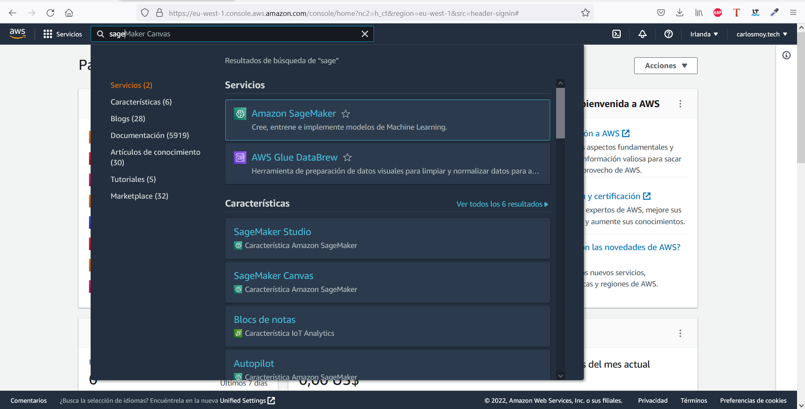

Once there, we are going to select the SageMaker **dashboard** in the menu at the left side of the screen, and clik on *Open studio*. By doing so, a new page will be opened and AWS will request us to create a *user profile*, as the following image shows:

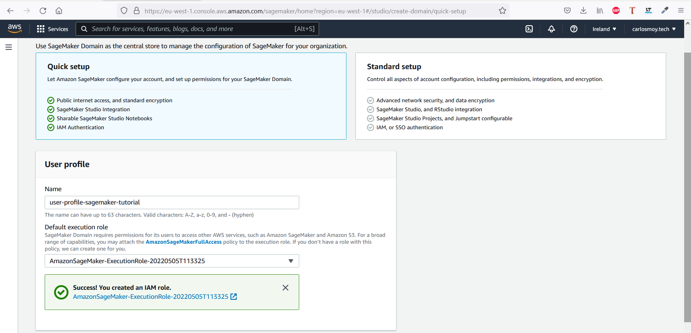

In the image above, a IAM role has already been created and defined as execution role. The option of creating a new IAM role leads us to the following screen:

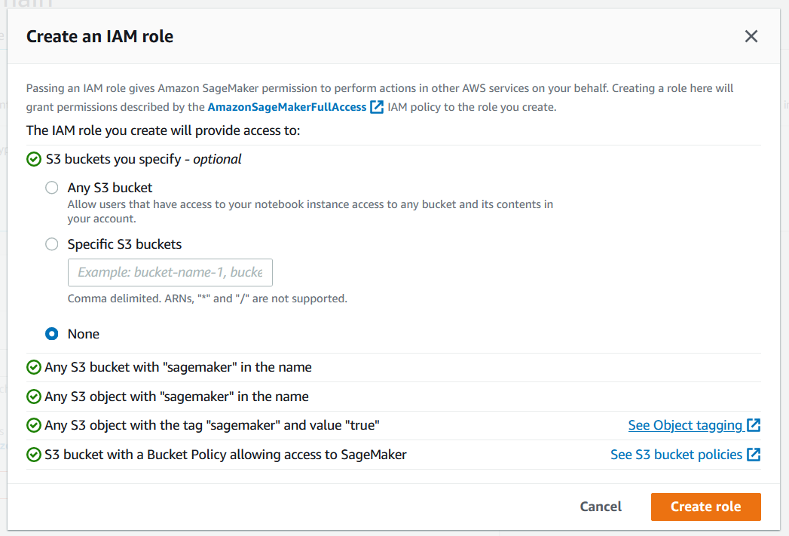

The most important detail of that role definition is the access policy to S3 buckets. Note that we are only providing access to S3 buckets which contain the word *"sagemaker"* to the new role, however, if desired, access to different existing S3 buckets can be provided explicitly.

After this *user profile* definition, the subsequent action is to create a **notebook instance** by navigating to ``Notebook/Notebook instances`` in the left menu and clicking on the button *Create notebook instance*.

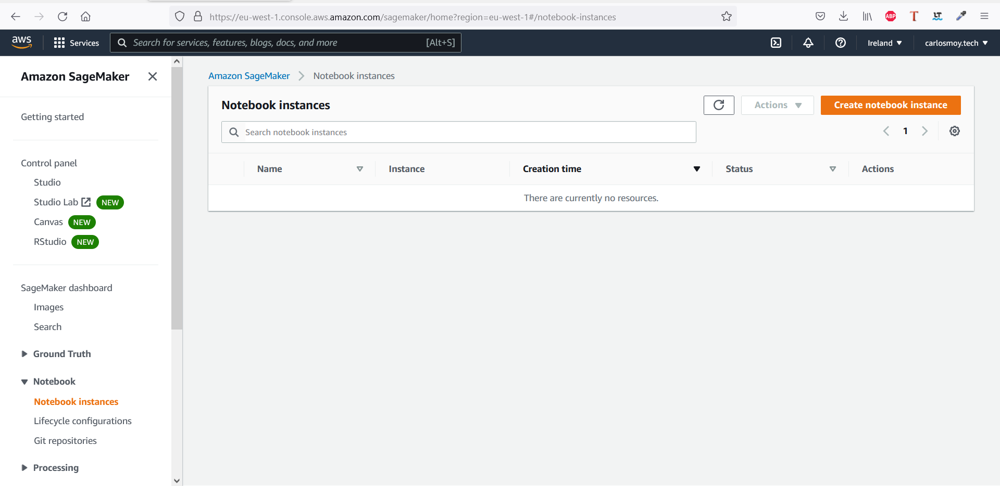

In the page which appears after clicking on that button, we are given the possibility to choose the configuration parameters for the notebook. The name of the new notebook will be *NotebookInstanceTutorialCCBDA*, and for the sake of simplicity, we will leave the default values for all parameters except for **instance type** (selected value: *ml.t2.medium*) and for **IAM role** (selected value: *the IAM role created or used in previous steps*). After clicking on the button ***"Create notebook instance"*** at the bottom part of the configuration page, the following screen will be shown to us, with the new notebook appearing with *InService* status (note that it might take up to 2 mins for the instance to be *InService*):

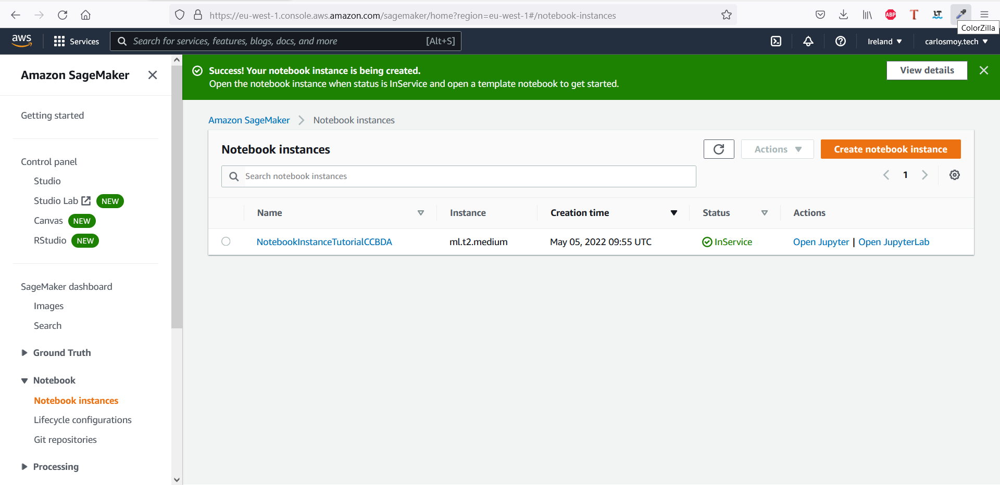

### 1.2 Prepare the data

The objective of this second step is to process the data needed to train the model that we want to deploy. For achieving this, first of all we have to follow the link ***Open Jupyter*** situated below the column actions in the Notebook instances menu.

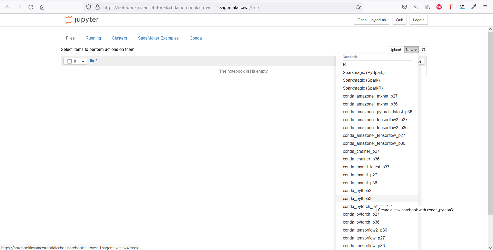

The mentioned action opens Jupyter Notebook in a new tab of our browser, as the screenshot above depicts. It is also shown how to select *conda_python3* as the desired version of Python and package manager for the new notebook.

As in every Python notebook, at the beginning we are going to define the imports and some environment variables:

```python

# import libraries
import boto3, re, sys, math, json, os, sagemaker, urllib.request
from sagemaker import get_execution_role
import numpy as np                                
import pandas as pd                               
import matplotlib.pyplot as plt                   
from IPython.display import Image                 
from IPython.display import display               
from time import gmtime, strftime                  
from sagemaker.serializers import CSVSerializer

# Define IAM role
role = get_execution_role()
prefix = 'sagemaker/DEMO-xgboost-dm'
containers = {'us-west-2': '433757028032.dkr.ecr.us-west-2.amazonaws.com/xgboost:latest',
              'us-east-1': '811284229777.dkr.ecr.us-east-1.amazonaws.com/xgboost:latest',
              'us-east-2': '825641698319.dkr.ecr.us-east-2.amazonaws.com/xgboost:latest',
              'eu-west-1': '685385470294.dkr.ecr.eu-west-1.amazonaws.com/xgboost:latest'} # each region has its XGBoost container
my_region = boto3.session.Session().region_name # set the region of the instance
print("Success - the MySageMakerInstance is in the " + my_region + " region. You will use the " + containers[my_region] + " container for your SageMaker endpoint.")

```

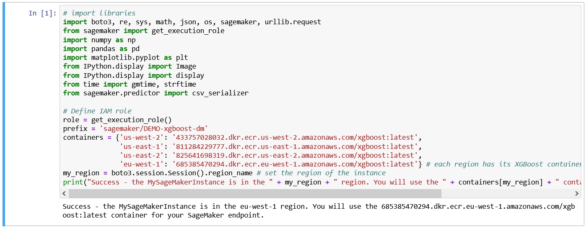

The next thing to do is to create an Amazon S3 bucket programatically to store the data of this tutorial, as the following Python code chunk indicates:

```python

bucket_name = 'sagemaker-ccbda-tutorial-bucket'
s3 = boto3.resource('s3')
try:
    if  my_region == 'us-east-1':
      s3.create_bucket(Bucket=bucket_name)
    else: 
      s3.create_bucket(Bucket=bucket_name, CreateBucketConfiguration={ 'LocationConstraint': my_region })
    print('S3 bucket created successfully')
except Exception as e:
    print('S3 error: ',e)

```

There ``bucket_name`` acts as identifier, and it has to be unique (AWS does not allow to have two ``S3 buckets`` with the same name in the same zone).

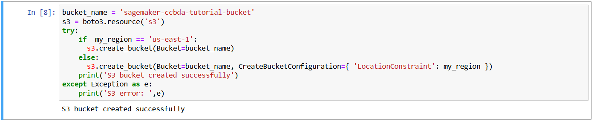

Once the bucket has been created, we download the dataset from the internet and load it in the notebook using the popular **Pandas** package, by executing the following statements:

```python

try:
  urllib.request.urlretrieve ("https://d1.awsstatic.com/tmt/build-train-deploy-machine-learning-model-sagemaker/bank_clean.27f01fbbdf43271788427f3682996ae29ceca05d.csv", "bank_clean.csv")
  print('Success: downloaded bank_clean.csv.')
except Exception as e:
  print('Data load error: ',e)

try:
  model_data = pd.read_csv('./bank_clean.csv',index_col=0)
  print('Success: Data loaded into dataframe.')
except Exception as e:
    print('Data load error: ',e)

```

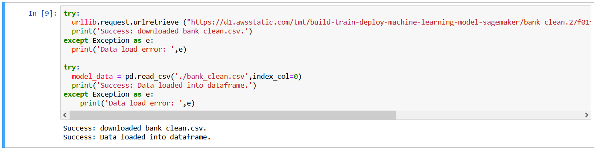

### 1.3 Train the model to learn from the data

Before being able to train the model, in every ML project it is highly recommended to split the original dataset in two:

- ***train dataset***: Typically corresponding to a random sample containing the 70% of the instances of the original dataset. This dataset will be used to train the model.

- ***test dataset***:: Typically corresponding to a random sample containing the 30% of the instances of the original dataset. This dataset will be used to measure the performance of the model and its ability to generalize new data.

This splitting procedure of the original dataset can be summarized in the following two lines of Python code:

```python

train_data, test_data = np.split(model_data.sample(frac=1, random_state=1729), [int(0.7 * len(model_data))])
print(train_data.shape, test_data.shape)

```

It is a good practice to check the presence of *null values* in both the training and test datasets (in the next screenshot we are only doing that for the train dataset):

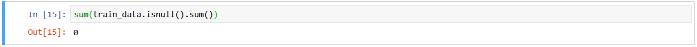

As it can be observed, our training dataset does not contain null values. It might also be interesting to apply the functions *"describe()"* or *"info()"* over the Pandas dataframes storing the datasets to obtain a simple overview (basic statistics) of the data we are working with.

For training the **XGBoost** model (AWS's implementation), the format of the dataset needs to be changed. After doing that, the training dataset can be readily stored in the S3 bucket that we have created in the previous steps:

```python

pd.concat([train_data['y_yes'], train_data.drop(['y_no', 'y_yes'], axis=1)], axis=1).to_csv('train.csv', index=False, header=False)
boto3.Session().resource('s3').Bucket(bucket_name).Object(os.path.join(prefix, 'train/train.csv')).upload_file('train.csv')
s3_input_train = sagemaker.TrainingInput(s3_data='s3://{}/{}/train'.format(bucket_name, prefix), content_type='csv')

```

### 1.4 Deploy the model

By introducing and executing the chunk of code which is shown below, we are creating an instance of an **XGBoost** model and defining its hyperparameters. Finding the optimal values for those hyperparameters is part of the job of the Data Scientist/ML engineer, but **that process is out of the scope of this tutorial** and won't be covered.

```python

sess = sagemaker.Session()
xgb = sagemaker.estimator.Estimator(containers[my_region],role, instance_count=1, instance_type='ml.m4.xlarge',output_path='s3://{}/{}/output'.format(bucket_name, prefix),sagemaker_session=sess)
xgb.set_hyperparameters(max_depth=5,eta=0.2,gamma=4,min_child_weight=6,subsample=0.8,silent=0,objective='binary:logistic',num_round=100)

```

Now that we have created our estimator, we can train it using [gradient descent](https://en.wikipedia.org/wiki/Gradient_descent) in an *ml.m4.xlarge* instance (see hyperparameters of the previous chunk) by executing the following line of code:

```python

xgb.fit({'train': s3_input_train})

```

The output of that line of code will be something like the content of the next screenshot, but be aware that the computation might take some minutes:

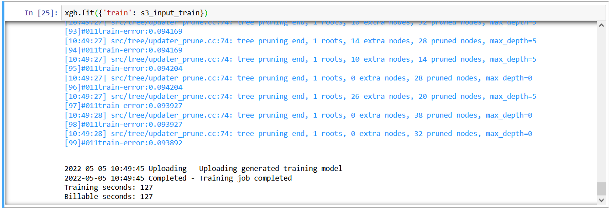

### 1.5 Evaluate your ML model's performance

Once the model has been trained, the next step is to implement the model in a server and create an endpoint to easily access it and be able to perform inference. We can achieve this objective with the following chunk of Python code:

```python

xgb_predictor = xgb.deploy(initial_instance_count=1,
                           instance_type='ml.m4.xlarge',
                           serializer=CSVSerializer())

```

Now that we have the endpoint with the model up and running, we can predict is the clients in the test dataset will enroll or not for a certificate of deposit by executing these lines in a separate cell of the notebook:

```python

test_data_array = test_data.drop(['y_no', 'y_yes'], axis=1).values # load the data into an array
predictions = xgb_predictor.predict(data=test_data_array, initial_args={'ContentType': 'text/csv'}).decode('utf-8') # predict!
predictions_array = np.fromstring(predictions[1:], sep=',') # and turn the prediction into an array
print(predictions_array.shape)

```

With the data returned by the model after predicting, we can create a crosstab to visualize the output of the model for the test dataset in a more intuitive way:

```python

cm = pd.crosstab(index=test_data['y_yes'], columns=np.round(predictions_array), rownames=['Observed'], colnames=['Predicted'])
tn = cm.iloc[0,0]; fn = cm.iloc[1,0]; tp = cm.iloc[1,1]; fp = cm.iloc[0,1]; p = (tp+tn)/(tp+tn+fp+fn)*100
print("\n{0:<20}{1:<4.1f}%\n".format("Overall Classification Rate: ", p))
print("{0:<15}{1:<15}{2:>8}".format("Predicted", "No Purchase", "Purchase"))
print("Observed")
print("{0:<15}{1:<2.0f}% ({2:<}){3:>6.0f}% ({4:<})".format("No Purchase", tn/(tn+fn)*100,tn, fp/(tp+fp)*100, fp))
print("{0:<16}{1:<1.0f}% ({2:<}){3:>7.0f}% ({4:<}) \n".format("Purchase", fn/(tn+fn)*100,fn, tp/(tp+fp)*100, tp))

```

The result of the previous chunk of code will be:

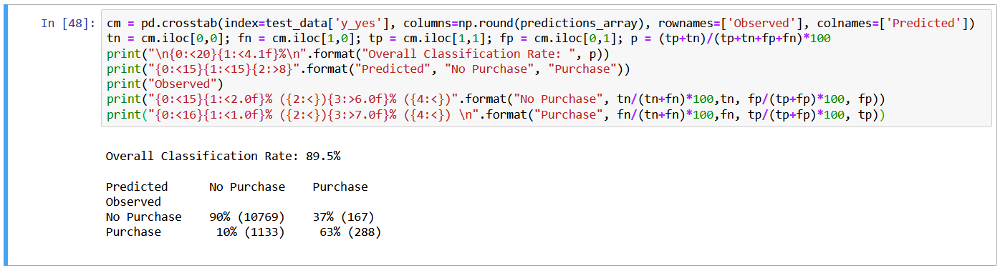

As it can be observed, we are achieving an **89.5% of accuracy** in the test dataset. This is more than enough for a first attempt, but it could be improved a bit for sure!

The crosstab that we have built is called **confusion matrix**, and it allows us to analyze the prediction mistakes of the model. In our case, this confusion matrix is indicating us that our model predicted the positive class (**will enroll for a certificate of deposit**) for 90% of the clients in the test dataset with an accuracy of 65% (278/429) for the enorolled and of 90% (10 785/11 928) for the not enrolled.

Finally, in order not to be billed in excess by AWS, we need to terminate all the created resources executing the following lines of code:

```python

xgb_predictor.delete_endpoint()
bucket_to_delete = boto3.resource('s3').Bucket(bucket_name)
bucket_to_delete.objects.all().delete()

```

**Congratulations, you have now learned how to create, train and implement a state-of-the-art ML model with Amazon SageMaker Studio!**

<a name="Task2"/>

## Task 2: Using Amazon SageMaker Canvas for the same use case

For this second part, we are going to use the interactive service ``Amazon SageMaker Canvas`` which provides business analytics that allow to generate accurate ML predictions without requiring any machine learning experience or having to write code.

With **SageMaker Canvas**, you can quickly connect and access data from cloud and on-premises data sources, combine datasets, and create unified datasets for training ML models. SageMaker Canvas automatically detects and corrects data errors and analyzes data readiness for ML. It is integrated with Amazon SageMaker Studio, making it easier to share models and datasets with other data scientists.

### 2.1 Create Role

As in the previous section (*Amazon SageMaker Studio*),  you can create a new IAM role with S3 buckets access policy or select an existing one.

### 2.2 Open Canvas

From the ``Control Panel``, from the selected *user* ``Launch app`` selecting the **Canvas** option.

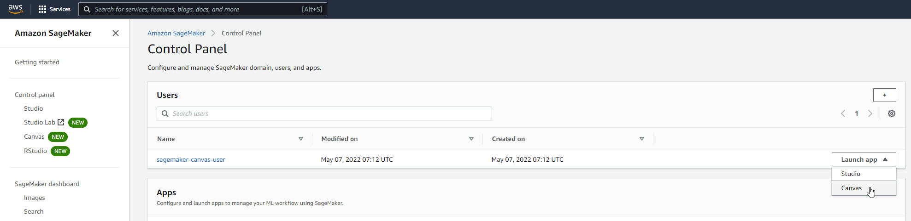

### 2.3 Import Dataset

From the previous steps notice that an S3 bucket was generated in order to store the *Train* and *Test* datasets.

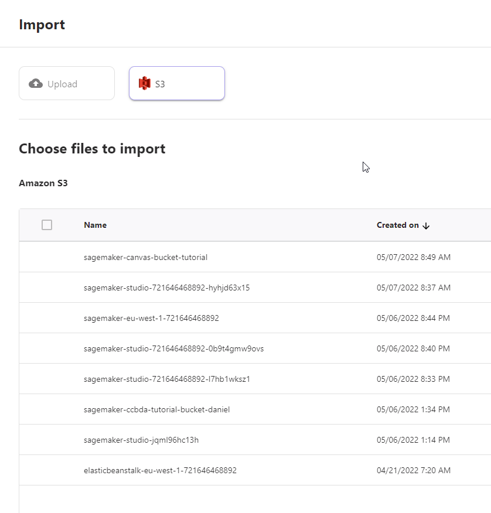

Select the S3 from where we are going to upload the data and choose the two data sets.

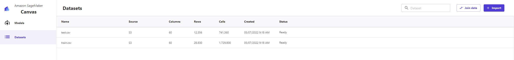

As previusly explained, we are going to build a clasification model trying to predict if the clients will enroll for a certificate of deposit. Therefore, we are going to choose the ``y_yes`` column to be predicted.

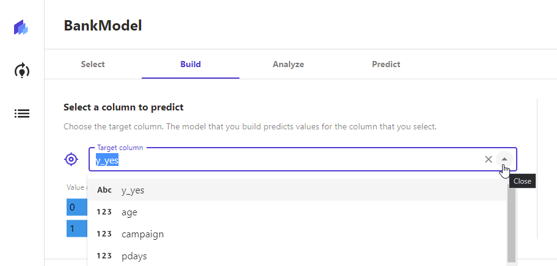

---

**NOTE**

You should modify the previous notebook to export the datasets with headers.

---

After SageMaker analyses the dataset, it will display a preview model where you can study its accuracy.

### 2.4 Train

Then, you can click in the ``quick build`` button to build our model with the *Train* dataset. This process could take long (between 10 to 15 minutes).

Check the metrics and add the [confusion matrix](https://en.wikipedia.org/wiki/Confusion_matrix) to the README.

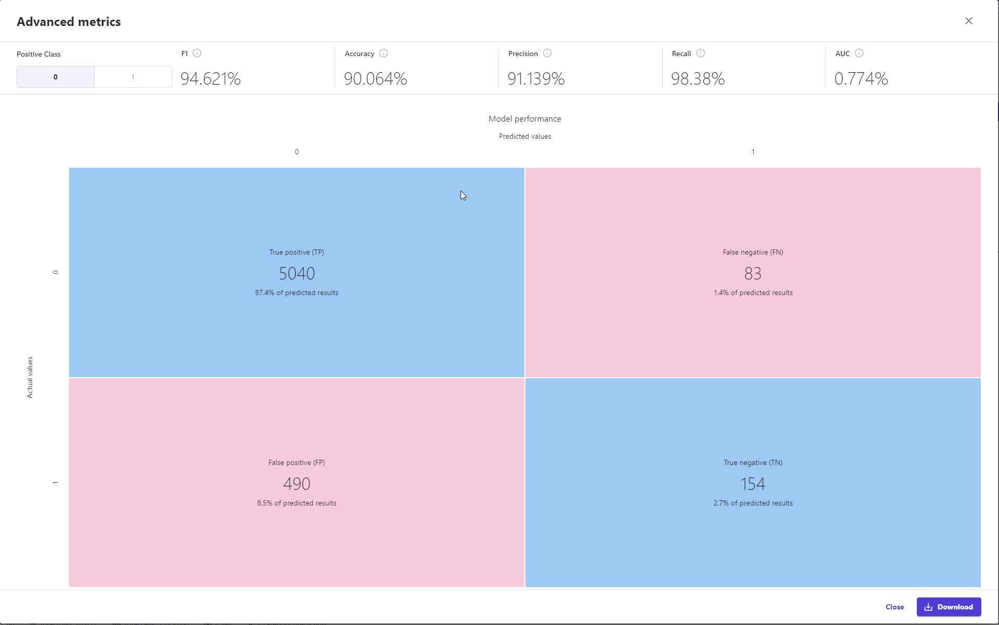

See which features from the dataset can increase your accuracy.

### 2.5 Test

Now, in the predict tab, upload the *Test* dataset.

Select the ``single prediction`` and modify the column values to predict the ``y_yes`` in real time.

**Congratulations, you have now learned how to create, train and implement a state-of-the-art ML in Amazon SageMaker Canvas without having to write a single line of code!**

## Useful links to keep learning more

* [Amazon SageMaker Features](https://docs.aws.amazon.com/sagemaker/latest/dg/whatis.html)
* [Coursera's introduction to Amazon SageMaker](https://www.coursera.org/lecture/aws-machine-learning/introduction-to-amazon-sagemaker-QugTh)
* [AWS' YouTube channel](https://www.youtube.com/channel/UCd6MoB9NC6uYN2grvUNT-Zg)
