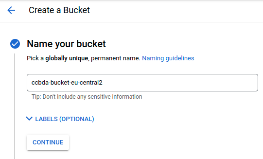
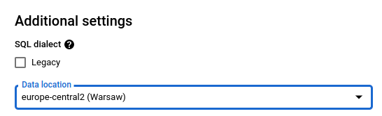

# CCBDA – Research Project 2022

## About

The goal of this project is to demonstrate the combined functionality of Google Storage and Google Datastudio for storaging and visualizing data on the cloud.

### Overview of the tasks:

1. Creating a GCP (Google Cloud Platform) account
2. Creating a bucket and uploading data
3. Creating an external permenent table for BigQuery
4. Drawing a graph with DataStudio

## Authors

Monika Dziedzic <br>
Oliver Bollverk

## Account creation
Create an account and add billing to your account in order to be able to use Cloud storage.

## Bucket creation
1. Once ready, go to Google Cloud Console and find “Storage” in the navigation menu and choose Cloud Storage > Browser. You can pin the tab in order to get quicker access


2. Choose <strong>Create bucket</strong>.



3. Choose a data location


Multi-region would be best for production environments, but for us one region is enough.


4. Choose default storage class:


5. Control access to the objects - for security reasons:


6. Object data protection - leave as default


7. Click Create.

## Add data to your bucket

1. Choose Upload files:


2. Upload shortened_income_data_separated_by_pipes.csv from my  <strong>CCBDA-project</strong> git repository. This file was created using the cleaning script (clean-dataset.sh) on the dataset downloaded from this page: 
https://datos.gob.es/en/catalogo/ea0010587-porcentaje-de-poblacion-con-ingresos-por-unidad-de-consumo-por-debajo-de-determinados-umbrales-fijos-por-sexo-y-nacionalidad-adrh-identificador-api-48439. 

I chose the one separated with semicolons. The script shortens the file and replaces all semicolons with pipe symbols so that BigQuery can read CSV files properly. Its schema detection doesn’t work correctly for csv files with columns separated by semicolon. It works only for: “,”, “|” and “\t” (not simply 4 spaces):


## Create an external permanent table for BigQuery

Why a permanent table?
“You can query an external data source in BigQuery by using a permanent table or a temporary table. A permanent table is a table that is created in a dataset and is linked to your external data source. Because the table is permanent, you can use access controls to share the table with others who also have access to the underlying external data source, and you can query the table at any time.

When you query an external data source using a temporary table, you submit a command that includes a query and creates a non-permanent table linked to the external data source. When you use a temporary table, you do not create a table in one of your BigQuery datasets. Because the table is not permanently stored in a dataset, it cannot be shared with others. Querying an external data source using a temporary table is useful for one-time, ad-hoc queries over external data, or for extract, transform, and load (ETL. processes.” (source: Querying Cloud Storage data | BigQuery)

1. Find BigQuery in the navigation menu (under Analytics): 


2. Before creating a table, we first have to create a dataset:


3. See that your dataset has been created:


4. Now we’ll finally create a table. There are many ways to create a table. One of them is through the Cloud console, but we’ll use DDL, as it’s a more automated way. We don’t have to specify the schema, as BigQuery uses schema auto-detection. However, note that we still have to add “skip_leading_rows” if we want the header to be skipped (Querying Cloud Storage data | BigQuery).
In order to create an external table using a Cloud Storage data source, you must provide the Cloud Storage URI (gs://bucket/file). In our case, it is <strong>gs://ccbda-bucket-eu-central2/shortened_income_data_separated_by_pipes.csv</strong> .

```SQL
CREATE OR REPLACE EXTERNAL TABLE income_dataset.income
OPTIONS (
 format = 'CSV',
 uris = ['gs://ccbda-bucket-europe-central2/shortened_income_data_separated_by_pipes.csv'],
 skip_leading_rows = 1
)
```

5. Run the query. Now see that your table has been created:


When you click on the table name, you can see that table fields match the first line of the .csv file:


6. Now we’ll query our table:

```SQL
SELECT * FROM `double-rigging-349914.income_dataset.income` LIMIT 1000
```

Pay attention to the queried region. In case you encounter a similar error to this one:


Make sure you’re querying the same region in which your data is stored. It should look like this:


If it doesn’t, you have to go to the Query settings:


Then, scroll to Additional settings and choose the proper data location.



## Draw graph with DataStudio

1. Go to https://datastudio.google.com
2. Click Create > Report
3. Complete your account setup:


4. Find BigQuery, click on it and authorize it:


5. Add data to report:


Verify columns (fields. were added properly:


6. Now we can create graphs like these:


In order to create the first one, you have to:

7. Click on Add a chart and choose Bar:


8. Click on the page to place the graph somewhere.
9. Drag-and-drop Nacionalidad and Sexo fields from the ones available on the right

In order to create the second one:
10. Click on <strong>Add a chart</strong> again and this time choose Table
11. Now drag-and-drop these fields: "Distribuci__n_de_la_renta_por_unidad_de_consumo" and "Sexo" into the dimension section

## Sources
https://towardsdatascience.com/google-cloud-storage-gcs-to-bigquery-the-simple-way-4bb74216b8c8 <br>
https://cloud.google.com/bigquery/external-data-cloud-storage <br>
https://cloud.google.com/bigquery/docs/schema-detect#auto-detection_details <br>
https://support.google.com/datastudio/answer/7511998#zippy=%2Cin-this-article <br>
https://support.google.com/datastudio/answer/6300774?hl=en&ref_topic=9372036#zippy=%2Cin-this-article <br>


